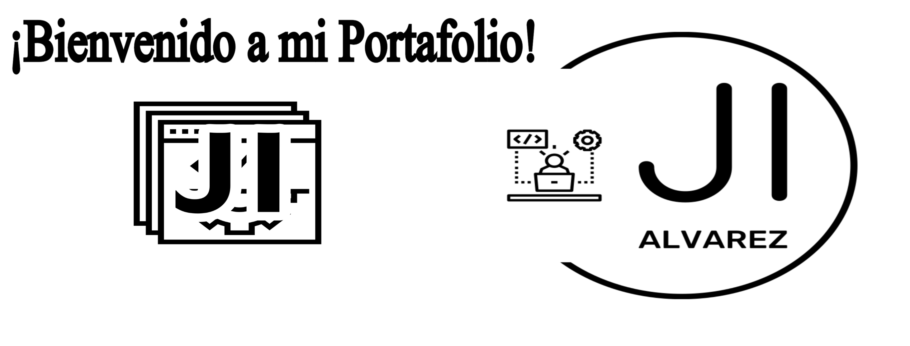

## 👋 ¡Hola! Soy Juan Ignacio Alvarez, un apasionado estudiante de informática y aspirante a programador. Mi objetivo es ingresar al mundo IT y contribuir con mi pasión por la programación y el desarrollo de software.

## 🗂️ Secciones

1. **Inicio:**
   - ¡Bienvenido a [juanignacio.tech](https://juanignacio.tech)! Aquí encontrarás información sobre mí y mis proyectos.

2. **Acerca de Mí:** 🙋‍♂️
   - Soy estudiante de informática con un fuerte interés en el desarrollo de software. Mi curiosidad y dedicación me llevan a aprender constantemente sobre nuevas tecnologías y prácticas de programación.

3. **Tecnologías:** 💻
   - Trabajo con tecnologías como **React**, **Spring Boot**, y **bases de datos** para construir aplicaciones modernas y eficientes.

4. **Proyectos Destacados:** 🚀
   - [**Sistema de Recursos Humanos**](https://github.com/JuanIgnacioAlvarez/Sistema-de-Recursos-Humanos-con-Spring-Boot-y-React.git): Desarrollé un sistema completo de gestión de recursos humanos utilizando Spring Boot y React.
   - [**Menú Digital**](https://github.com/JuanIgnacioAlvarez/Menu-Digital.git): Creé una aplicación de menú digital para restaurantes utilizando tecnologías frontend y backend.

5. **Contacto:** 📬
   - ¿Quieres hablar sobre un proyecto o simplemente saludar? ¡Envíame un mensaje a través del formulario de contacto en [juanignacio.tech](https://juanignacio.tech/contacto)!

## 🌐 Redes Sociales y Enlaces

- [LinkedIn](https://www.linkedin.com/in/juan-ignacio-1294j20i30a) 🔗
- [GitHub](https://github.com/JuanIgnacioAlvarez1294) 🐱‍💻
- [Instagram](https://www.instagram.com/nacho.alvarez1294) 📸
- [Facebook](https://www.facebook.com/profile.php?id=100086197218855) 👍
- Email: contacto@juanignacio.tech 📧
- [Currículum Vitae]() 📄

## 🖼️ Capturas de Pantalla

¡Pronto añadiré capturas de mis proyectos más recientes!

## 🛠️ Instalación y Ejecución Local

Si deseas ver mi portafolio en tu máquina local, simplemente clona este repositorio y sigue las instrucciones en el archivo `INSTALL.md`.

## 🙏 Agradecimientos

Agradezco a la comunidad de desarrollo y a mis mentores por su constante apoyo y aprendizaje compartido.
