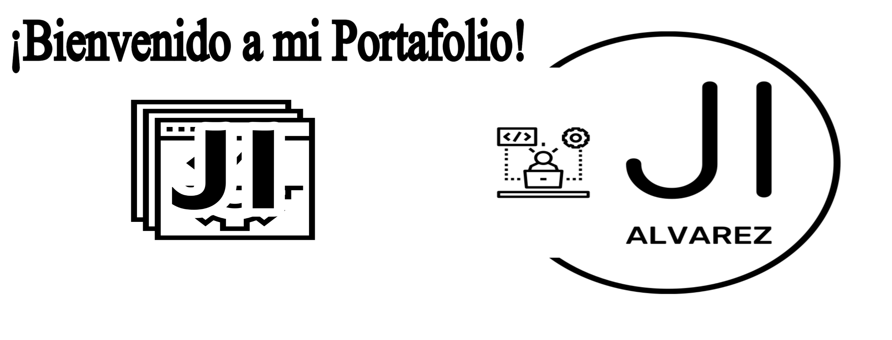

# ¡Hola! Soy Juan Ignacio Alvarez 👋

### 👨‍💻 Licenciado en Informática | Backend Developer Junior
Apasionado por la tecnología y el aprendizaje constante. Me especializo en el ecosistema **Java** y **Spring Boot**, construyendo soluciones escalables y eficientes.

---

## 🚀 Sobre Mí
- 🎓 **Graduado:** Licenciatura en Informática - Universidad Siglo 21.
- 📚 **Formación Continua:** Participante del programa **Talentos Tech** (Java) y estudiante autodidacta de Inglés Técnico.
- 💡 **Mente de Principiante:** Enfocado en absorber conocimientos de expertos, trabajar en equipo y aportar valor desde el primer día.

---

## 🛠️ Tecnologías y Herramientas
- **Backend:** Java, Spring Boot, Spring Cloud (Microservicios), Node.js.
- **Frontend:** React, Next.js, JavaScript, HTML/CSS.
- **Bases de Datos:** MySQL, MongoDB, Oracle, Firebase.
- **Herramientas:** Docker, Git/GitHub, Postman, Maven, n8n.

---

## 📂 Proyectos Destacados

### ⚡ [Láser Divino - Gestión de Turnos](https://github.com/JuanIgnacioAlvarez1294/Appointment-management.git)
Sistema Full Stack para la administración de centros de estética. 
- **Tech:** React, Next.js, Firebase (Auth & DB).
- **Logro:** Integración de pagos reales con la API de **Mercado Pago**.

### 🏗️ [Platform B2B - Microservicios](https://github.com/JuanIgnacioAlvarez1294/company-platform.git)
Arquitectura distribuida pensada para la escalabilidad empresarial.
- **Tech:** Java, Spring Boot, Spring Cloud, Netflix Eureka, API Gateway.
- **Estado:** Backend completo / Frontend en desarrollo.

### 👥 [Sistema de RRHH](https://github.com/JuanIgnacioAlvarez1294/Sistema-de-Recursos-Humanos-con-Spring-Boot-y-React.git)
Gestión integral de empleados y departamentos.
- **Tech:** Spring Boot y React.

---

## 🌐 Conectemos
- **Portfolio:** [juanignacio.tech](https://my-portafolio-5b6df.web.app/)
- **LinkedIn:** [in/juanignacio-tech](https://www.linkedin.com/in/juanignacio-tech/)
- **Email:** [nacho1294.ji@gmail.com](mailto:nacho1294.ji@gmail.com)

---
*“Disciplina, curiosidad y compromiso en cada línea de código”*.
